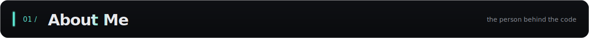
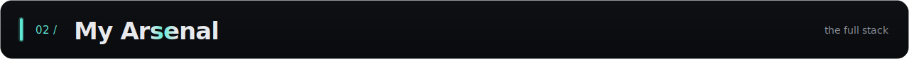
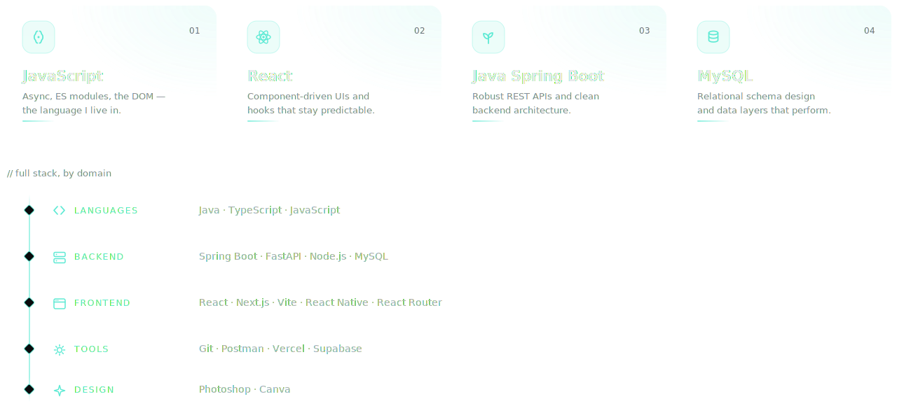

<!--
  ╔══════════════════════════════════════════════════════════════════════╗
  ║  Amit Suissa — GitHub profile                                        ║
  ║  Design language mirrors amit-suissa-portfolio.vercel.app            ║
  ║                                                                      ║
  ║  Palette : accent #5eead4 · base #0a0b0d · text #e8e9ec             ║
  ║  Type    : Space Grotesk (display) · JetBrains Mono · Manrope        ║
  ║                                                                      ║
  ║  All visuals are self-contained animated SVGs in /assets (fonts are  ║
  ║  subset + embedded, so nothing is fetched at render time). To edit   ║
  ║  copy/colours, open the matching file in /assets — no build needed.  ║
  ╚══════════════════════════════════════════════════════════════════════╝
-->

  &nbsp;
  &nbsp;
  &nbsp;
  

 

<table>
  <tr>
    <td valign="top" width="56%">
      

        I'm a third-year <strong>Computer Science</strong> student at
        <strong>Ashkelon Academic College</strong> (B.Sc. — 2027), and my coding
        journey began in <strong>2024</strong>. Since then I've been steadily
        growing my <strong>full-stack</strong> expertise — and weaving modern
        tooling and <strong>AI agents</strong> into my workflow to ship faster,
        more reliable, more efficient software.
      

      

        I care about <strong>clean, high-level code</strong>, preventing security
        vulnerabilities, and delivering a genuinely good user experience. Above
        all, I'm driven by a real passion for building software and a strong
        motivation to grow in the tech industry.
      

      

        <code>Full-Stack</code> &nbsp;<code>AI-assisted workflow</code> &nbsp;<code>Clean &amp; secure code</code> &nbsp;<code>UX / UI focused</code>
      

      

        <strong>Studying</strong> &nbsp;B.Sc. Computer Science · Ashkelon Academic College · 2027 
        <strong>Based in</strong> &nbsp;Nir Hen, Israel · Hybrid / On-site 
        <strong>Status</strong> &nbsp;&nbsp;&nbsp;Open to full-stack roles
      

    </td>
    <td valign="top" width="44%">
      
    </td>
  </tr>
</table>

  &nbsp;
  &nbsp;
  &nbsp;
  

 

  
    
  <em>Building fast, real-time web products — from the database up to the pixel.</em>
    
  © 2026 Amit Suissa · Full-Stack Developer · Israel

